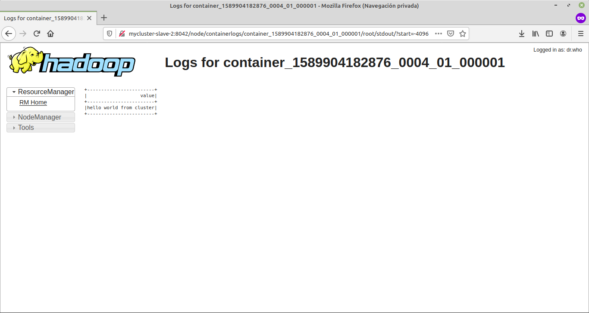
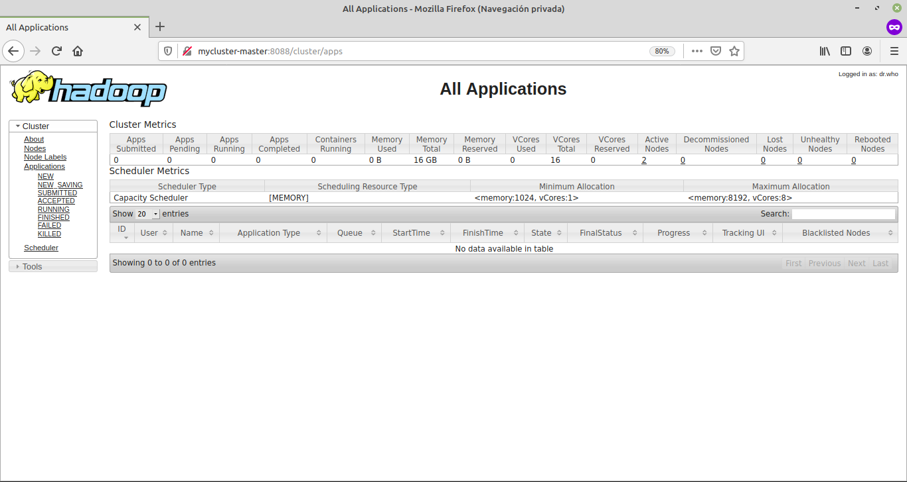
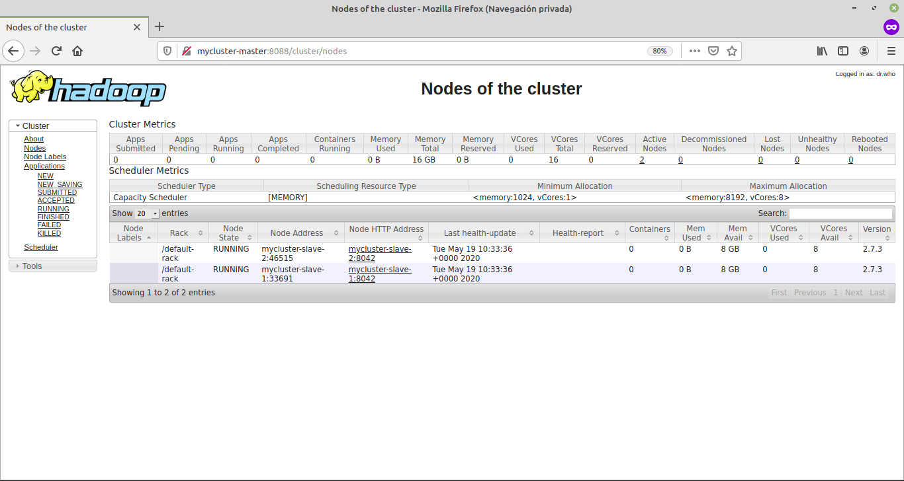
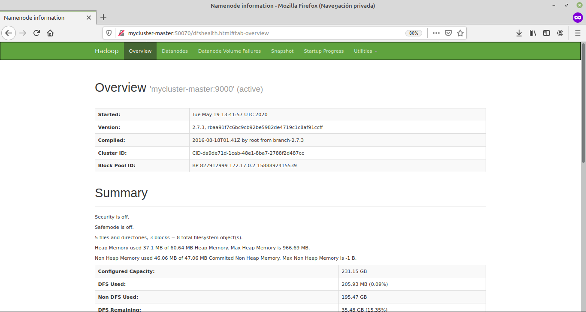

# Docker hadoop yarn cluster for spark 2.3.2

## docker-spark-yarn-cluster 
This application allows to deploy multi-nodes hadoop cluster with spark 2.3.2 on yarn.
It also includes a solr cloud cluster if for instance you need to deploy a spark application using solr data.

## Setup
- Clone the repo 
- cd inside ../docker-spark-yarn-cluster 
- Follow the next instructions

## Run docker-compose

``` bash
docker-compose build
docker-compose up -d
```

## Stop

``` bash
docker-compose down
```

## Setup 

On Linux machines add ip addresses to "/etc/hosts":

```
10.7.0.2 mycluster-master
10.7.0.3 mycluster-slave-1
10.7.0.4 mycluster-slave-2
10.7.0.5 zookeeper
10.7.0.6 solr1
10.7.0.7 solr2
```

Ssh access:

``` bash
sh setup_ssh_access_root.sh
```

## Access

- Docker
    ```bash 
    docker exec -it mycluster-master bash
    ```

- Ssh
    ```bash 
    ssh root@mycluster-master
    ```

## Run spark applications from host :

WARNING: Must have tuned the /etc/hosts file as described above before

First of all, create user home dir in HDFS to allow spark uploading jar files. Get a shell
on the cluster (see above) then, say your user name on your laptop (the docker host) is foo:

```
hdfs dfs -mkdir -p /user/foo
hdfs dfs -chown foo:foo /user/foo
```

Then run for instance PI example:

```
# Point to spark install on your host, matching the workspace spark version
export SPARK_HOME=<path to spark home>
# Need to point to cluster config files so that spark-submit knows how to connect to the cluster
export HADOOP_CONF_DIR=${PWD}/config
# Run spark PI example. Could also use --deploy-mode cluster. Jar file name must match your spark version.
# If want to see history of run in History Server, add: --conf spark.eventLog.enabled=true --conf spark.eventLog.dir=hdfs:///tmp/spark/history
$SPARK_HOME/bin/spark-submit --master yarn --deploy-mode client --num-executors 2 --executor-memory 2G --executor-cores 4 --class org.apache.spark.examples.SparkPi $SPARK_HOME/examples/jars/spark-examples_2.11-2.3.2.jar
```

## Run spark applications from cluster :

- spark-shell : 
    ```bash
     spark-shell --master yarn --deploy-mode client
    ```

- Examples :

    - 1
        ``` bash
        echo "hello world from cluster" > hello_world.txt
        
        hadoop fs -put -f hello_world.txt /apps/hello_world.txt 
        
        echo 'spark.read.text("hdfs://mycluster-master:9000/apps/hello_world.txt").show(1000,1000)' > HelloWorld.scala
        echo 'sys.exit' >> HelloWorld.scala
      
        spark-shell --master yarn --deploy-mode client -i HelloWorld.scala  
        ```
        
    - 2
        ```bash
        spark-shell -i /app/workspace/files/examples/HelloWorld.scala 
        ```
  
    - 3
        ```bash
        spark-submit --deploy-mode cluster --master yarn /app/workspace/files/examples/hello_world.py
        ```
  
  
  should output something similar to :
  
  - 1 and 2
  ```bash
  20/05/19 15:08:36 INFO Client: Application report for application_1589900555706_0002 (state: RUNNING)
  20/05/19 15:08:36 INFO Client: 
  	 client token: N/A
  	 diagnostics: N/A
  	 ApplicationMaster host: 10.7.0.3
  	 ApplicationMaster RPC port: -1
  	 queue: default
  	 start time: 1589900911818
  	 final status: UNDEFINED
  	 tracking URL: http://mycluster-master:8088/proxy/application_1589900555706_0002/
  	 user: root
  20/05/19 15:08:36 INFO YarnClientSchedulerBackend: Application application_1589900555706_0002 has started running.
  20/05/19 15:08:42 INFO Main: Created Spark session with Hive support
  Spark context Web UI available at http://mycluster-master:4040
  Spark context available as 'sc' (master = yarn, app id = application_1589900555706_0002).
  Spark session available as 'spark'.

  20/05/19 15:08:53 INFO DAGScheduler: Job 1 finished: show at HelloWorld.scala:24, took 0.102030 s
  +------------------------+
  |                   value|
  +------------------------+
  |hello world from cluster|
  +------------------------+
  
  20/05/19 15:08:53 INFO SparkContext: Invoking stop() from shutdown hook
  20/05/19 15:08:53 INFO SparkUI: Stopped Spark web UI at http://mycluster-master:4040
  ```
  
  - 3
  

- Access to Hadoop cluster Web UI : http://mycluster-master:8088
 
    
    
    
 
- Access to spark Web UI : http://mycluster-master:8080

    
    
- Access to hdfs Web UI : http://mycluster-master:50070

    

- Access to spark History Web UI : http://mycluster-master:18080

- Access to solr1 Web UI : http://solr1:8983

- Access to solr2 Web UI : http://solr2:8983

----------------------------------------------------------------

# Original approach for running the cluster

## Build image
- Clone the repo 
- cd inside ../docker-spark-yarn-cluster 
- Run `docker build -t pierrekieffer/spark-hadoop-cluster .`

## Run
- Run `./startHadoopCluster.sh`
- Access to master `docker exec -it mycluster-master bash`

## Stop 

- `docker stop $(docker ps -a -q)`
- `docker container prune`


